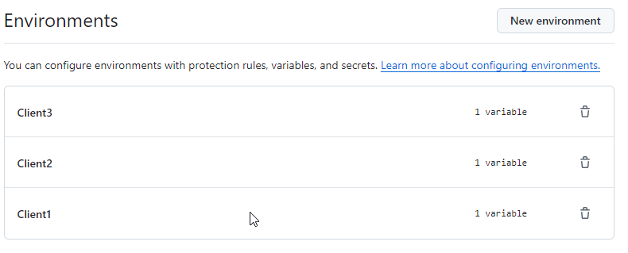

# Workflows pour déployer une application sur plusieurs clients

[https://github.com/MaTeamSibador/TestMutltiDeploy/actions/workflows/deployMultiEnv.yaml/badge.svg]

Nous avons besoins de déployer l'application pour plusieurs clients. Nous voulons que le pipeline soit dynamique. A chaque nouveau client nous ne modifions pas le pipeline.

## Pré-requis

Dans les réglages du repositorie, nous créons un environnement par client. Et dans cette environnemnt nous ajoutons les variables et les secrets spécifiques aux clients.



Pour plus de détails sur la [gestion des environnements](https://docs.github.com/fr/actions/managing-workflow-runs-and-deployments/managing-deployments/managing-environments-for-deployment)

## Le workflow

### Récupération des environnements

Dans le 1er job, on récupére la liste des environnements avec l'appel api à l'aide du github cli.

```bash
lists="$(gh api repos/$OWNER/$REPO/environments|jq -c '[.environments[].name|tostring]')"
```

Le résulat est ensuite envoyé en variable sortie du job

```bash
echo 'listenvs='$lists >> "$GITHUB_OUTPUT"
```

### Déploiement de l'application

Pour le déploiement de l'application, on utilise une matrice pour boucler sur les environements. On récupérant la variables output du job précédent.

```yaml
    needs:
    - list-environments
    strategy:
      matrix:
        environment: ${{ fromJSON(needs.list-environments.outputs.listenvs) }}
```

Pour en savoir plus sur [la stratégie de matrice](https://docs.github.com/fr/actions/writing-workflows/choosing-what-your-workflow-does/running-variations-of-jobs-in-a-workflow)
